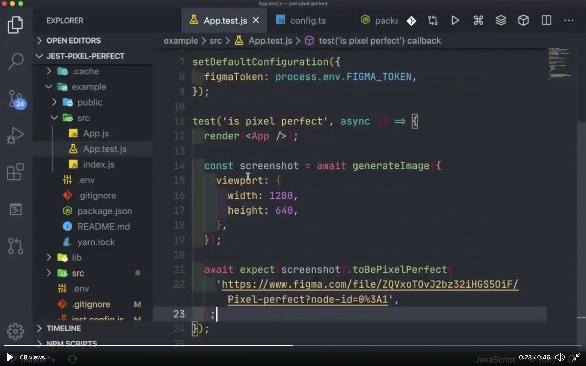

# Jest Pixel Perfect

Jest matcher to check if your frontend matches the design.

[](https://twitter.com/i/status/1263899580946681862)

## Installation

With npm:

```sh
npm install --save-dev jest-pixel-perfect
```

With yarn:

```sh
yarn add -D jest-pixel-perfect
```

## Usage

```js
import React from 'react';
import { render } from '@testing-library/react';
import { generateImage } from 'jsdom-screenshot';
import App from './App';

test('is pixel perfect', async () => {
  render(<App />);

  const screenshot = await generateImage({
    viewport: {
      width: 1280,
      height: 640,
    },
  });

  await expect(screenshot).toBePixelPerfect(URL_TO_FIGMA_FRAME);
});
```

You can pass different argument to `toBePixelPerfect`:

- a URL to a frame in a Figma file
- a URL to a frame in an XD file
- a path to a local PNG file
- a Buffer

## Setup

### Jest >v24

Add `jest-pixel-perfect` to your Jest `setupFilesAfterEnv` configuration. [See for help](https://jestjs.io/docs/en/configuration.html#setupfilesafterenv-array)

```json
"jest": {
  "setupFilesAfterEnv": ["jest-pixel-perfect"]
}
```

### Jest <v23

```json
"jest": {
  "setupTestFrameworkScriptFile": "jest-pixel-perfect"
}
```

If you are already using another test framework, like [jest-chain](https://github.com/mattphillips/jest-chain), then you should create a test setup file and `require` each of the frameworks you are using.

For example:

```js
// ./testSetup.js
require('jest-pixel-perfect');
require('jest-chain');
require('any other test framework libraries you are using');
```

Then in your Jest config:

```json
"jest": {
  "setupTestFrameworkScriptFile": "./testSetup.js"
}
```

### Default Configuration

You can set a default configuration (for example to use the same token everywhere) by using a setup file:

```js
// ./testSetup.js
const { setDefaultConfiguration } = require('jest-pixel-perfect');
require('jest-chain');
require('any other test framework libraries you are using');

setDefaultConfiguration({
  figmaToken: process.env.FIGMA_TOKEN,
  xdToken: process.env.XD_TOKEN,
});
```

### Typescript

If your editor does not recognize the custom `jest-pixel-perfect` matchers, add a `global.d.ts` file to your project with:

```ts
import 'jest-pixel-perfect';
```
